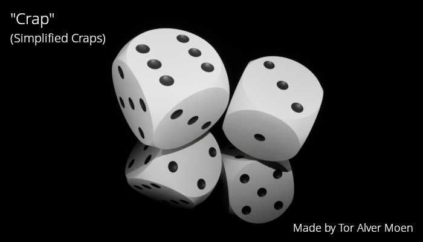

This game is a simplified version of the casino game Craps and is played with two dice and the rules are as follows:

The rules for the first turn:
* If you roll 7 or 11 you win
* If you roll 2 (Snake Eyes), 3 or 12 you lose
* All other rolls will be added to the points and you will continue to the next round

The rules for all subsequent turns:
* If you roll the same sum as the previous round you win
* If you roll 7 you lose
* All other rolls will be added to the points and you will continue to the next round

---

This application including the graphics was made by Tor Alver Moen.

It was coded in C# WPF. The 3D dice was made with <a href="https://www.blender.org" target="_blank">Blender</a> and rendered in <a href="https://www.unrealengine.com" target="_blank">Unreal Engine 5</a>. The 2D dice was made with <a href="https://www.gimp.org" target="_blank">GIMP - GNU Image Manipulation Program</a>.

#### Screenshot:

