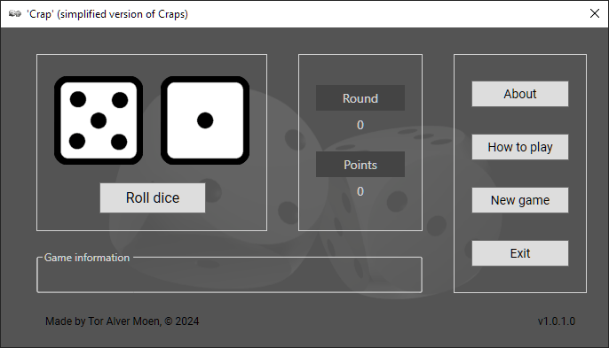

This game is a simplified version of the casino game Craps and is played with two dice and the rules are as follows:

Rules for the First Turn:
* If you roll a 7 or 11, you win.
* If you roll a 2 (Snake Eyes), 3, or 12, you lose.
* All other rolls will be added to your points, and you will continue to the next round.

Rules for All Subsequent Turns:
* If you roll the same sum as the previous round, you win.
* If you roll a 7, you lose.
* All other rolls will be added to your points, and you will continue to the next round.

---

This application including the graphics was made by Tor Alver Moen.

It was coded in C# WPF with [Visual Studio Community](https://visualstudio.microsoft.com/). The 3D dice was made with [Blender](https://www.blender.org/) and rendered in [Unreal Engine 5](https://www.unrealengine.com). The 2D dice was made with [GIMP - GNU Image Manipulation Program](https://www.gimp.org).

#### Screenshot:

